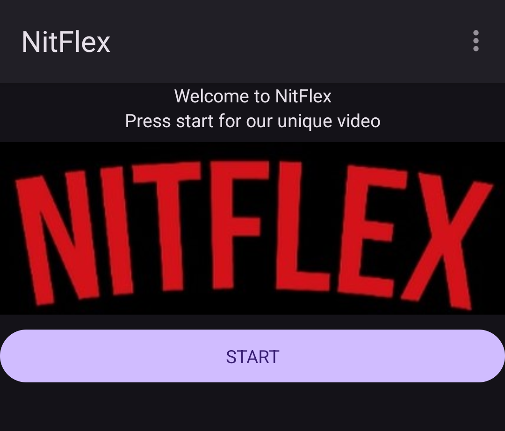

# UQAC - Semestre 4

I chose to do my semester abroad at the University of Quebec in Chicoutimi (UQAC) in Canada. I'm here from January to May 2024. This repository contains all the work I did during this semester:

- [ ] [Programmation orientée objet](./POO) (TDs not graded, TP and project graded)
  - [x] [TD1](./POO/TD1)
  - [ ] [TD2](./POO/TD2)
  - [ ] [TP1](./POO/TP1) (graded X/20)
  - [ ] [TD3](./POO/TD3)
  - [ ] [TD4](./POO/TD4)
- [ ] [Informatique mobile](./Mobile) (TDs not graded, TPs and project graded)
  - [x] [TD1](./InfoMob/HelloDroide/) - Discovering Android Studio, First Application
  - [x] [TP1](./InfoMob/nitflex/) - Internationalization, Themes, Styles, Menu (graded X/20)    
  
  - [ ] [Project](./InfoMob/Projet) - Maybe Online Store (Amazon-like)
    - [ ] [Synopsis](./InfoMob/Projet/Synopsis.pdf) - Project description
- [ ] [Réalité virtuelle](./VR) (Presentation graded)
  - [x] [Presentation VR app/concept](./VR/VR_presentation_w4.md) (graded X/20)