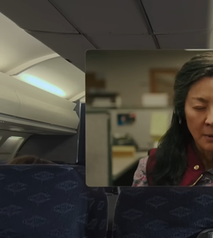

## Image représentative de l’application ou du concept de l’informatique spatiale
Picture 1: AR mode  
 
 

 <i>Picture 2: VR mode</i> 

## Source : 
https://youtu.be/TX9qSaGXFyg?t=312
https://www.theverge.com/2023/6/22/23770217/apple-vision-pro-travel-mode-plane-rides-vr
## Titre :
Passer de l’AR à la VR (Nommée par Apple : Travel mode)
## Type de l’informatique spatiale (AR, VR ou XR) :
XR :  Expérience de réalité étendue
## Description :
Un seul casque virtuel mixant réalité augmenté et réalité virtuelle permettant de passer de l’un a l’autre pour contrôler exactement l’immersion au monde virtuel et l’isolation au monde réel.
## Caractéristique :
- 1 seul casque.
- 1 molette (ou contrôleur)
## Critiques :
✅ J’aime le fait de pouvoir contrôler parfaitement l’environnement et de choisir le taux d’immersion avec un seul et unique casque, ne pas à avoir à changer de casque  
❌ Diminution de la qualité en AR, le monde réel est vu au travers d’écrans et de caméras et non juste avec les yeux comme dans par exemple le projet Google Lens  
📈 Grâce à la XR de nombreuses possibilités s’offre à nous : Zoom pour lecture de loin (e.g. de panneau), Capture vidéo/photo d’évènement, contrôle automatique de l’immersion par I.A., visualisation des limites de l’espace de jeu, …

